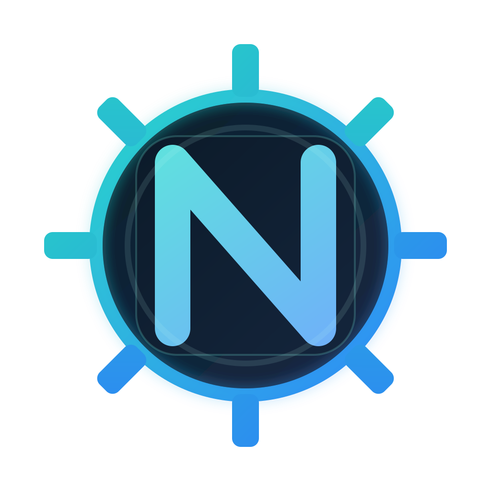

# nssmr (Non-Sucking Service Manager _Redux_)

[](https://github.com/jonlabelle/nssm-redux/actions/workflows/ci.yml)
[](https://github.com/jonlabelle/nssm-redux/actions/workflows/codeql.yml)
[](https://github.com/jonlabelle/nssm-redux/releases/latest)
[](https://pkg.go.dev/github.com/jonlabelle/nssm-redux)
[](https://github.com/jonlabelle/nssm-redux/actions/workflows/govulncheck.yml)



> Currently a work in progress, but early feedback is welcome! See the [compatibility notes](docs/compatibility.md) for details on the current scope and design decisions.

`nssmr` is a Go port of [NSSM](https://nssm.cc), the Non-Sucking Service Manager for Windows.

This repository is intentionally starting with a strong CLI and service-runtime core instead of trying to port the legacy GUI first. The current codebase already installs and runs arbitrary executables as Windows services, persists settings in the familiar `Parameters` registry layout, and ships CI/release automation for Windows binaries.

## Table of Contents

- [Status](#status)
- [Quick Start](#quick-start)
- [More Configuration Examples](#more-configuration-examples)
- [Build](#build)
  - [Windows hosts (PowerShell)](#windows-hosts-powershell)
  - [Unix-like hosts (`make`)](#unix-like-hosts-make)
  - [Windows VERSIONINFO metadata](#windows-versioninfo-metadata)
  - [Releases](#releases)
- [Docs](#docs)
- [Credits](#credits)
- [License](#license)

## Status

`nssmr` is an early CLI-first Go port of NSSM focused on Windows service installation, configuration, and runtime supervision.

The current milestone covers the core management commands, registry-compatible `Parameters` storage, restart policy, hooks, process controls, and log rotation.

The legacy GUI is intentionally out of scope for now. See the [compatibility notes](docs/compatibility.md) for detailed parity coverage and current gaps, and the [GUI parity checklist](docs/gui-parity.md) for a feature-by-feature comparison with classic NSSM.

## Quick Start

`nssmr` wraps an existing executable and runs it as a Windows service. In the examples below, `worker.exe` is your application, not part of `nssmr`.

1. Install a service for your application:

   ```bash
   nssmr install MyService "C:\apps\worker.exe" --config "C:\apps\worker.yml"
   ```

   Everything after the executable is stored as `AppParameters`.

2. Configure the working directory, logs, and startup behavior:

   ```bash
   nssmr set MyService AppDirectory "C:\apps"
   nssmr set MyService AppStdout "C:\logs\worker.out.log"
   nssmr set MyService AppStderr "C:\logs\worker.err.log"
   nssmr set MyService DisplayName "My Worker Service"
   nssmr set MyService Start SERVICE_DELAYED_AUTO_START
   ```

3. Start the service and inspect the stored configuration:

   ```bash
   nssmr start MyService
   nssmr status MyService
   nssmr get MyService AppParameters
   ```

## More Configuration Examples

<details>
<summary>Show more configuration examples</summary>

After install, you can layer on more advanced behavior:

```bash
nssmr set MyService AppDirectory "C:\apps"
nssmr set MyService AppStdout "C:\logs\worker.out.log"
nssmr set MyService AppStderr "C:\logs\worker.err.log"
nssmr set MyService AppEnvironment "ENV=prod" "PORT=8080"
nssmr set MyService AppEvents Start/Pre "C:\hooks\before-start.cmd"
nssmr set MyService AppRotateFiles 1
nssmr set MyService AppRotateOnline 1
nssmr set MyService AppTimestampLog 1
nssmr set MyService AppPriority ABOVE_NORMAL_PRIORITY_CLASS
nssmr set MyService AppAffinity 0-3
nssmr set MyService AppStopMethodSkip 0
nssmr set MyService ObjectName "NT AUTHORITY\LocalService"
nssmr set MyService Start SERVICE_DELAYED_AUTO_START
```

Inspect or export configuration:

```bash
nssmr get MyService AppParameters
nssmr processes MyService
nssmr rotate MyService
nssmr dump MyService
```

> [!NOTE]
> The `service` subcommand is the internal SCM entrypoint used by the installed Windows service and is not intended for normal interactive use.

</details>

## Build

Source builds currently require Go `1.26.1` or newer, matching [go.mod](go.mod).

### Windows hosts (PowerShell)

<details>
<summary>Show Windows build instructions</summary>

Use the PowerShell helper from the repository root with PowerShell 7+ (`pwsh`):

```powershell
.\build.ps1 test
.\build.ps1 build
.\build.ps1 build-windows
```

This writes the host binary to `bin\nssmr.exe` and the Windows release artifacts to:

- `dist\nssmr-windows-amd64.exe`
- `dist\nssmr-windows-arm64.exe`

`build.ps1` keeps `GOCACHE` and `GOMODCACHE` inside the repo at `.gocache/` and `.gomodcache/`, which avoids depending on a writable user-profile cache.

Windows VERSIONINFO fields are read from [`build/windows-versioninfo.json`](build/windows-versioninfo.json). Edit that file to change the embedded product metadata, or point `build.ps1` at another JSON file with `-VersionInfoFile`.

Run `.\build.ps1 help` to see the full task list, including `vet`, `lint`, `fmt`, and `clean`.

VS Code workspace tasks are under [`.vscode/tasks.json`](.vscode/tasks.json) and use `pwsh` on Windows, so you can run the same flows from `Terminal` -> `Run Task`.

</details>

### Unix-like hosts (`make`)

<details>
<summary>Show Unix-like build instructions</summary>

If you already have GNU `make` and a POSIX shell available, the existing `Makefile` targets still work:

```bash
make test
make build
make build-windows
```

> [!Note]
> You can build on non-Windows hosts and run most tests, but the `install` command, service control, and the managed-process runtime only work on Windows.

Windows cross-builds also embed VERSIONINFO metadata from [`build/windows-versioninfo.json`](build/windows-versioninfo.json). You can override that path with `make build-windows WINDOWS_VERSIONINFO=/path/to/versioninfo.json`.

</details>

### Windows VERSIONINFO metadata

Windows release binaries include a VERSIONINFO resource generated from [`build/windows-versioninfo.json`](build/windows-versioninfo.json). The version fields split into human-readable strings and Windows fixed numeric versions:

| Field                 | Purpose                                                                                                                          |
| --------------------- | -------------------------------------------------------------------------------------------------------------------------------- |
| `fileVersion`         | String shown for this specific executable, `nssmr.exe`. Leave blank to use the build version.                                    |
| `productVersion`      | String shown for the product or release line. Leave blank to use the build version.                                              |
| `fixedFileVersion`    | Four-part numeric `VS_FIXEDFILEINFO` version for the executable, such as `1.2.3.0`. Leave blank to derive it from `fileVersion`. |
| `fixedProductVersion` | Four-part numeric `VS_FIXEDFILEINFO` version for the product. Leave blank to derive it from `productVersion`.                    |

The string fields may contain labels such as `v1.2.3`, `1.2.3-rc.1`, or a branch-oriented build name. The fixed fields are for Windows APIs and comparison tools, so they must resolve to up to four 16-bit integer components. For example, `v1.2.3` and `v1.2.3-rc.1` both derive fixed versions as `1.2.3.0`.

If the fixed fields are blank and the build version has no numeric version prefix, such as `dev`, `main-43a3f89`, or a bare commit SHA, the fixed value would become `0.0.0.0`. The Windows build helper prints a warning in that case. For non-tagged builds where fixed numeric versions matter, pass a tag-like `-Version` value or set `fixedFileVersion` and `fixedProductVersion` explicitly in the VERSIONINFO JSON.

### Releases

Releases are managed by semantic-release on pushes to `main` after CI passes. Conventional commits determine the next version, update [`CHANGELOG.md`](CHANGELOG.md), create the `vX.Y.Z` tag, and publish the GitHub release.

During the semantic-release `prepare` step, GitHub Actions runs `make release-artifacts VERSION=vX.Y.Z`. That target builds and packages:

- `dist/nssmr-windows-amd64.zip`
- `dist/nssmr-windows-arm64.zip`
- `dist/SHA256SUMS.txt`

The release zip files include `nssmr.exe`, `README.md`, `LICENSE`, and `CHANGELOG.md`. Semantic-release uploads the zip files and checksum file to the GitHub release.

## Docs

- [Changelog](CHANGELOG.md)
- [Documentation index](docs/README.md)
- [Compatibility and parity notes](docs/compatibility.md)

## Credits

- [NSSM](https://nssm.cc) for the original design and registry model

## License

[MIT](LICENSE)
